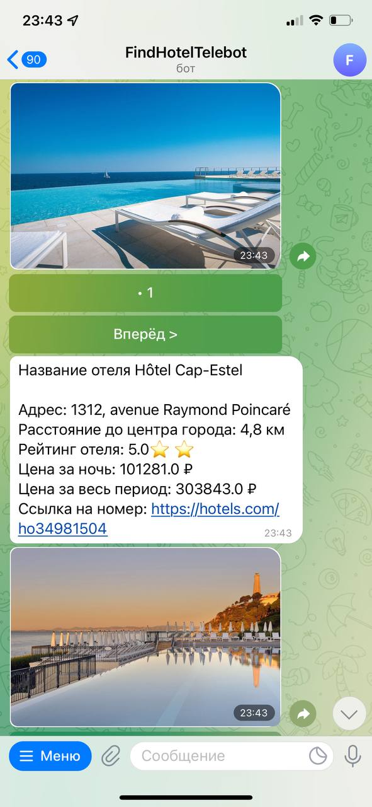

<h1 align="center">Телеграм бот по поиску отелей</h1>

## Описание
Данный бот был разработан при помощи rapidapi. Парсинг отелей происходит с сайта hotels.com
Для запуска данного бота нужно будет установить postgresql. Все необходимые данные находятся в env.example

Ссылка на [API](https://rapidapi.com/apidojo/api/hotels4/)

## Команды
Для пользователя доступны следующие комманды:
- /start - Запустить бота 💻 
- /help - Помощь 📣 
- /lowprice - Поиск самых дешёвых отелей в городе 📉 
- /highprice - Поиск самых дорогих отелей в городе 📈 
- /bestdeal - Поиск отелей, наиболее подходящих по цене и расположению от центра 🔥 
- /rating - Поиск отелей, с самым высоким рейтингом 🔝 
- /history - вывод истории поиска отелей 📖 
- /clear - Очистить историю отелей 🚮'

## Используемый стэк
- Aiogram 2.18
- Aiohttp 3.8.1
- PostgreSQL 14
- gino 1.0.1
- loguru 0.6.0

## Скриншоты бота

